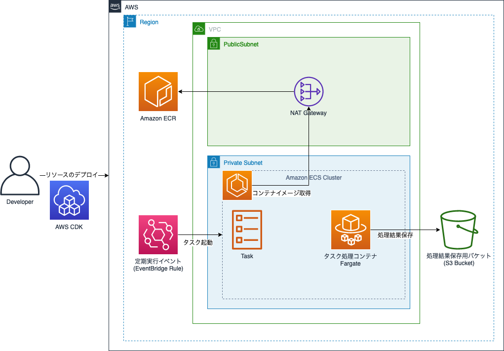

# README

EventBridge で ECS Task を定期実行し、S3 Bucket に処理結果を保存するサンプル実装です。AWS CDK を用いてリソースをデプロイします。



## How to deploy

### Prerequisites

以下の依存関係を事前にインストールしてください。

* Docker
* [Node.js](https://nodejs.org/en/download) (v18 or later)
* AWS CLI
* Administrator 相当の IAM policy
* [cdk bootstrap](https://docs.aws.amazon.com/ja_jp/cdk/v2/guide/bootstrapping.html) の実行

### Setup AWS CDK

以下のコマンドでライブラリをインストールし、AWS CDK のセットアップを実行します。

```bash
npm install
npx cdk bootstrap
```

本コマンドは各アカウント・リージョンで一度だけ実行する必要があります。

### Deploy resources

以下のコマンドを実行し、リソースをデプロイします。

```bash
npx projen deploy
```

デプロイに成功すると次のように出力されます。

```bash
event-driven-ecs-task-dev: deploying... [1/1]

 ✅  event-driven-ecs-task-dev (no changes)

✨  Deployment time: 6.49s

Outputs:
event-driven-ecs-task-dev.BucketName = event-driven-ecs-task-dev-bucket12345678-xxxxxxxxxxx
event-driven-ecs-task-dev.BucketURL = http://event-driven-ecs-task-dev-bucket12345678-xxxxxxxxxx.s3-website-us-east-1.amazonaws.com
```

表示されるバケット名を控えてください。

コンテナ上で実行されるプログラムは Golang で記述されており、 [app](./app/) から確認できます。
デフォルトでは1分おきに起動され、プログラムの開始時と終了時に上記の S3 バケットにテキストファイルをアップロードします。

## Clean up

サンプルの動作確認終了後、必要に応じてリソースを削除してください。

```bash
npx projen destroy
```

## build a docker image

コンテナ上で実行されるイメージを手元でビルドしたい場合、次のコマンドを用いてください。

```bash
cd app/
docker build --tag app .
```

## Test AWS CDK application

次のコマンドを用いて、[snapshot テスト](https://docs.aws.amazon.com/ja_jp/cdk/v2/guide/testing.html) を実行できます

```bash
npx projen test
```

## Tips

本サンプルの作成には [projen](https://github.com/projen/projen) を使用しました。
